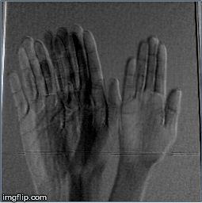

# Simple Python Script to Visualize the Features Extracted by a 3D CNN Filter

### 3D Convolution 

3D convolution is the extension of the 2D convolution concept used for learning on images which is extended to an extra 3rd dimension to be used on videos. Let's try to establish how a dynamic video is different from a static 2D (RGB isnt considered a dimension even though it has a depth of 3 for each image). We can consider a video stream to be consisting of several images or static video frames that when stacked together in time would produce a continuous stream of images or a video. 

For the purpose of differentiating videos its not enough just to learn features in the 2D spatial space but also the temporal space so as to account for the time component. This is the reason we resort to the usage of 3D convolutions, This algorithm inherently would account for both the spatial(images) features and also temporal(how these images change over time) features.

Once again, A GIF speaks a million words

image source : https://medium.com/apache-mxnet/1d-3d-convolutions-explained-with-ms-excel-5f88c0f35941

### A python script to visualize what are the features extracted by 3D convolution filters

We first record 16 images from a video of a hand gesture (making a simple wave) and we stack these images one behind the other. When we move through this stack in time we can see the hand moving to form the wave gesture.

### The 3D convolution function

Let's take a look at this simple function which performs 3D convolution of the input image and the filters

If you followed the simple python script that we used to perform convolution on static image of a cat. This function is just the extension of the same concept/math into one extra dimension. This essentially means we loop over one more dimension while performing convolution. Instead of taking slices of 2D image to convolve with a 2D filter, we are going to take a volume sliced from stacked images/frames to convolve with a 3D volume(filter).

### The feature map extracted by convolution

Let us get to the interesting part, I randomized the filter values and ran the 3D convolution of the stacked images of my hand representing a wave motion over time. The following GIF are the features extracted by the 3D filters.

I just stacked the output feature volume as static 2D images and ran it over time to obtain the GIF.

